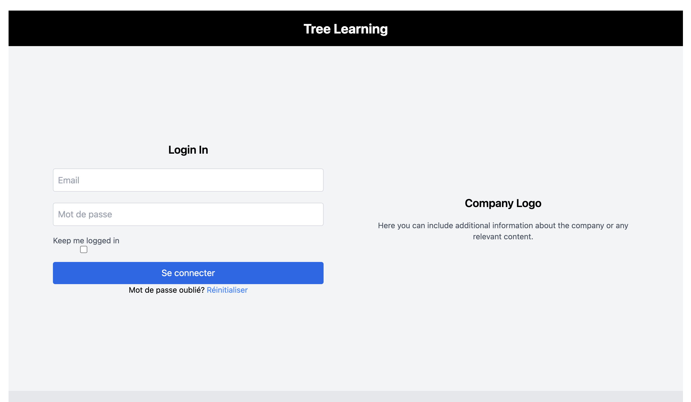

## Présentation du TP : Développement d'une Application de Cours en Ligne

### Objectifs du TP

Dans ce projet d'une semaine, nous allons développer une application web en TypeScript et React qui consomme une API sécurisée par un jeton JWT pour gérer l'accès aux cours en ligne. Vous apprendrez à structurer votre code en suivant la méthodologie Atomic Design, à intégrer RTK Query pour gérer les requêtes API, et à mettre en place un style visuel cohérent avec Tailwind CSS. Ce TP est idéal pour découvrir et mettre en pratique des concepts avancés de développement frontend, notamment :

1. **Atomic Design** : Apprendre à organiser le code en composants réutilisables, modulaires et maintenables.
2. **Gestion d'état avec Redux et RTK Query** : Utiliser Redux Toolkit et RTK Query pour gérer l’état global et les appels API de manière performante et structurée.
3. **Sécurisation avec JWT** : Intégrer une authentification sécurisée par jeton JWT pour restreindre l’accès aux ressources de l’application.
4. **APIs REST** : Comprendre comment interagir avec une API RESTful et structurer les requêtes.

### Fonctionnalités de l'application

- **Connexion utilisateur** : Une page de connexion avec un formulaire de saisie et un système d’authentification sécurisé par JWT.
- **Gestion des cours en ligne** : Afficher tous les cours accessibles après connexion et récupérer les informations via une API sécurisée.
- **Design modulaire** : Mettre en place un design soigné avec Tailwind CSS et suivre la structure Atomic Design pour organiser les composants de l’application.

### Déroulement du TP

Le TP se déroulera en deux parties principales :

#### 1. **Mise en place du Design avec Tailwind et Atomic Design**

   - Installer et configurer **Tailwind CSS** dans l’application.
   - Créer les composants de la page de connexion et de la liste des cours, en suivant les principes d’Atomic Design :
     - **Atomes** : Composants simples comme les boutons, champs de texte, etc.
     - **Molécules** : Composants regroupant plusieurs atomes, par exemple le formulaire de connexion.
     - **Organismes** : Composants complexes composés de molécules, par exemple la barre de navigation ou les cartes de cours.
   - Intégrer le design de chaque composant avec **Tailwind CSS** pour créer une interface soignée et réactive.

#### 2. **Gestion de l'API et sécurisation avec JWT**

   - Configurer **RTK Query** pour effectuer les appels API et gérer les états de chargement, de succès et d’erreur.
   - Implémenter l’authentification via un jeton **JWT** :
     - Lors de la connexion, récupérer un jeton JWT pour authentifier l’utilisateur.
     - Stocker le jeton JWT et le transmettre dans les requêtes pour accéder aux ressources sécurisées (comme la liste des cours).
   - Créer des requêtes pour récupérer les cours via **RTK Query** et afficher les données dans un composant d’organisme.

### Technologies utilisées

- **React + TypeScript** : pour une application frontend robuste et bien typée.
- **Redux Toolkit (RTK)** et **RTK Query** : pour la gestion d’état et les requêtes API.
- **Atomic Design** : pour organiser les composants de manière modulaire et réutilisable.
- **Tailwind CSS** : pour une gestion flexible et réactive du style.
- **JWT** : pour sécuriser l'accès aux ressources de l’application.

### Résultats attendus

À la fin de ce TP, vous aurez réalisé une application de cours en ligne, structurée et sécurisée. Vous aurez maîtrisé la mise en place d’une architecture solide et réutilisable, géré l’état global et les appels API avec RTK, et intégré un design réactif avec Tailwind CSS.

### Ce que vous devez faire 

1. Mise en place du projet

[mise en place présentation des architectures](./01_INSTALLATION_ARCHI.md)

2. Atomic design page d'accuei
   
    1. Vous devez intégrer cette page en respectant l'atomic design. 
   
    [atomic design précision](./01_TP_atomic_design.md)

    2. Respectez la structure de cette architecture


    ```txt
    .
    ├── atoms
    │   ├── Button.tsx
    │   └── Input.tsx
    ├── molecules
    │   └── LoginForm.tsx
    ├── organisms
    │   └── LoginSection.tsx
    ├── templates
    │   └── LoginTemplate.tsx

    ```

    3. Page d'accueil 

    


