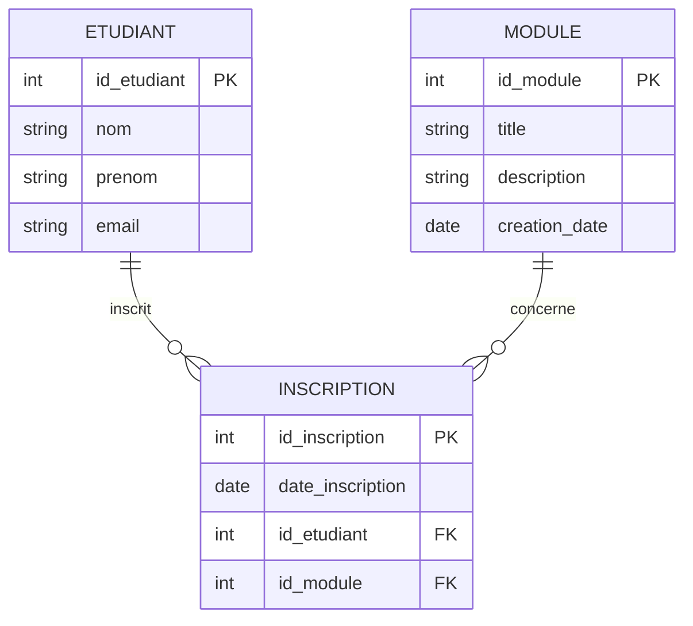

# Modelisation 

Implémentez un modèle de données

```mermaid
erDiagram
    ETUDIANT {
        int id_etudiant PK
        string nom
        string prenom
        string email
    }
    
    MODULE {
        int id_module PK
        string title
        string description
        date creation_date
    }
    
    INSCRIPTION {
        int id_inscription PK
        date date_inscription
        int id_etudiant FK
        int id_module FK
    }

    ETUDIANT ||--o{ INSCRIPTION : inscrit
    MODULE ||--o{ INSCRIPTION : concerne

```