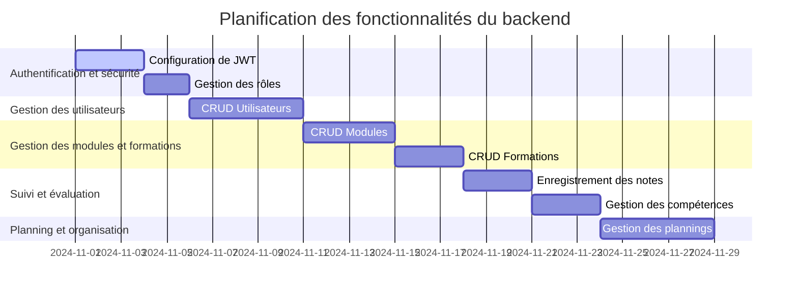

# Présentation

L'application que vous développez est un système de gestion de cours impliquant des formateurs, des étudiants et des modules de formation. Elle permet d'organiser et de structurer les parcours de formation, d'évaluer les compétences, de gérer les plannings des cours, et de suivre les progrès des apprenants. Elle inclut des fonctionnalités de notation, de gestion des compétences et d'évaluation pour fournir une vue complète sur la progression des utilisateurs dans les modules de formation.

### Besoins fonctionnels

| Fonctionnalité                    | Description                                                                                     |
|-----------------------------------|-------------------------------------------------------------------------------------------------|
| Gestion des utilisateurs          | Création, modification et suppression des comptes utilisateurs, avec des rôles (administrateur, formateur, apprenant). |
| Gestion des modules               | Création, organisation, et mise à jour des modules de cours (incluant nom, contenu, durée, etc.). |
| Gestion des formations            | Création et suivi des formations regroupant plusieurs modules. |
| Suivi des évaluations             | Enregistrement des notes et suivi des progrès des étudiants. |
| Gestion des plannings             | Organisation des plannings pour les modules de formation. |
| Gestion des compétences           | Création et attribution de compétences par rapport aux formations et aux cours. |
| Système de notation et feedback   | Attribution des notes et commentaires pour évaluer les performances. |
| Accès sécurisé                    | Gestion de la connexion sécurisée avec JWT pour limiter l’accès aux données sensibles. |

### Diagramme de Gantt pour la planification des features du backend

Ce diagramme représente une première planification des développements du backend, organisés par priorité. L'authentification JWT est implémentée en premier pour sécuriser les accès, suivie des modules de gestion des utilisateurs et des modules de cours.